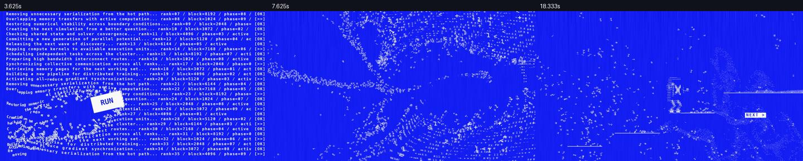

# SJTU Xflops HPC — ASCII Motion Film

30-second, 1920 × 1080, 24 fps promotional film for SJTU Xflops. All on-screen copy is English, with an original synthesized stereo soundtrack.



**[Watch / download the film](https://github.com/66CF/sjtu-xflops-hpc-film/releases/download/v1.0.0/SJTU_Xflops_Physics_v2.mp4)** · **[Motion revision comparison (silent)](https://github.com/66CF/sjtu-xflops-hpc-film/releases/download/v1.0.0/SJTU_Xflops_Motion_Changes.mp4)** · **[All release assets](https://github.com/66CF/sjtu-xflops-hpc-film/releases/tag/v1.0.0)**

## Motion and physics

- A visible `RUN` block collides with terminal characters. Letters release through contact, neighbouring impacts and accumulated fluid drag.
- A chip enters from the left and accelerates off the right edge before `FASTER`.
- The same flowing characters gather into a deformable 3D knot, preserving position, velocity, glyph and angle at the handoff.
- Parallel chip workers synchronize; the leader turns right, crouches, jumps onto three platforms, lands, and runs along the top platform.
- Readable emphasis uses independent white tiles with blue lettering.

The GPU cache was computed on an RTX 4070 Laptop GPU using CuPy/CUDA: 18,479 particles, a 1536 × 432 fluid grid and 120 Hz integration. The elastic knot uses 240 Hz NumPy mass–spring integration. Character choreography and independent captions are authored animation, not dynamic rigid-body simulation.

## Rebuild on macOS

Install Python 3, NumPy, Pillow and FFmpeg (including FFprobe). The renderer uses the macOS Menlo font at `/System/Library/Fonts/Menlo.ttc`.

```bash
git clone https://github.com/66CF/sjtu-xflops-hpc-film.git
cd sjtu-xflops-hpc-film
python3 -m venv .venv
source .venv/bin/activate
pip install -r requirements.txt
gh release download v1.0.0 --repo 66CF/sjtu-xflops-hpc-film --pattern physics-assets.zip
unzip physics-assets.zip
python3 source/build_director.py --check-only
python3 source/build_director.py
```

The bundle extracts the exact simulation inputs and baked caches into `work/physics-v5/`. **No GPU is needed to render the baked caches.** The final output is `output/SJTU_Xflops_Physics_v2.mp4`.

For CUDA recomputation and detailed production notes, see [source/README_PHYSICS.txt](source/README_PHYSICS.txt). Use the current inputs and generate a fresh base simulation before the gather pass.

## Source map

| File | Purpose |
| --- | --- |
| `source/build_director.py` | Validate assets, render, synthesize audio and mux the final film |
| `source/render_director.py` | Final film composition and ASCII material |
| `source/ascii_solids.py` | Analytic 3D surfaces and camera sampling |
| `source/opening_impact.py` | Shared visible cursor and collision geometry |
| `source/chip_choreography.py` | Shared chip entrance and rightward exit |
| `source/stair_choreography.py` | Grounded jump poses, foot contacts and exit |
| `source/export_physics_geometry.py` | Bake collision masks from the same visible geometry |
| `source/simulate_glyph_fluid.py` | CUDA fluid, contact and particle solver |
| `source/simulate_type_knot.py` | Continuous 3D elastic-knot simulation |
| `source/make_audio_director.py` | Original synthesized soundtrack |
| `source/film_material.py` | Blue/white texture and finishing |

The `render_kinetic.py`, `kinetic_geometry.py` and `kinetic_later.py` modules retain shared helpers and preview fallbacks. `build_director.py` is the current build entry point and requires the final caches.

## Reference

Art direction was informed by a supplied Coinbase reference film. That reference footage and audio are not included in this repository or the main film. The comparison release compares two original SJTU Xflops revisions, not the Coinbase reference.

Large generated media and caches are distributed through Releases rather than Git history. SHA-256 checksums are included in each release.
